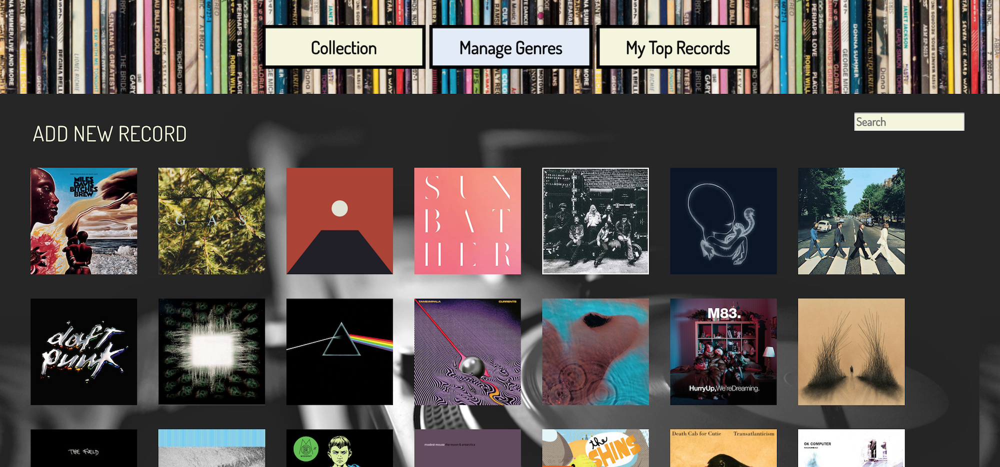
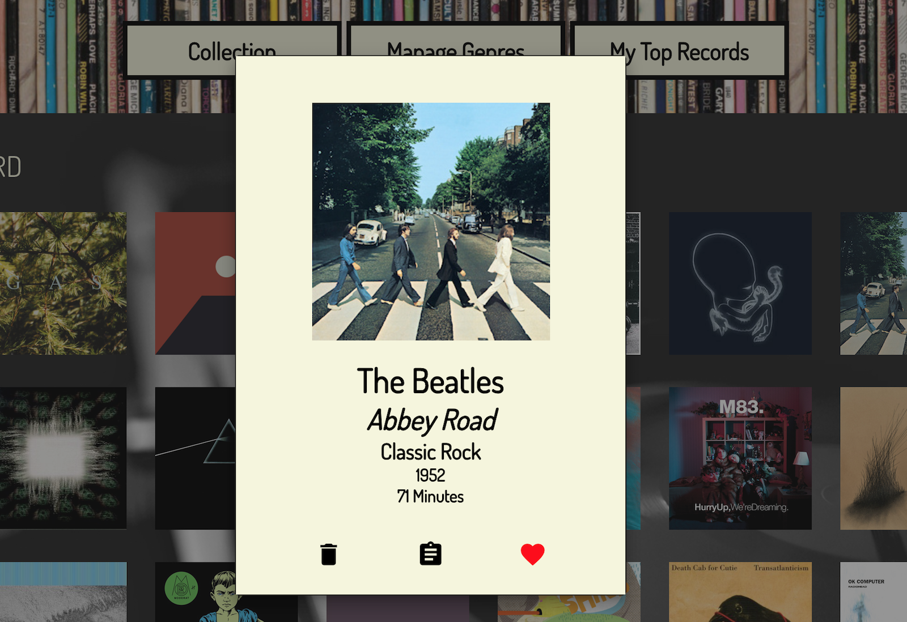
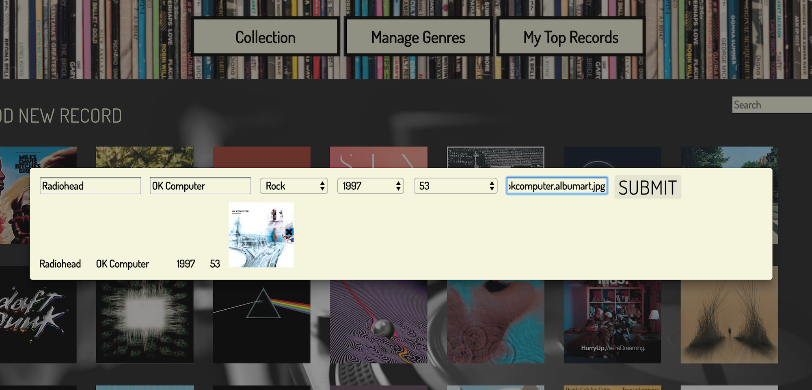
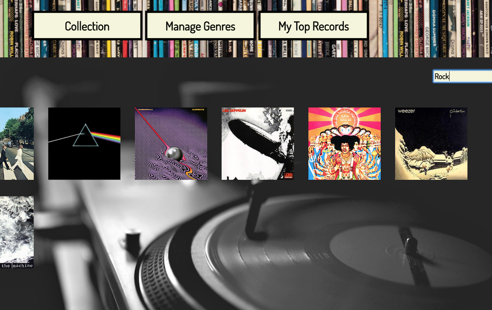
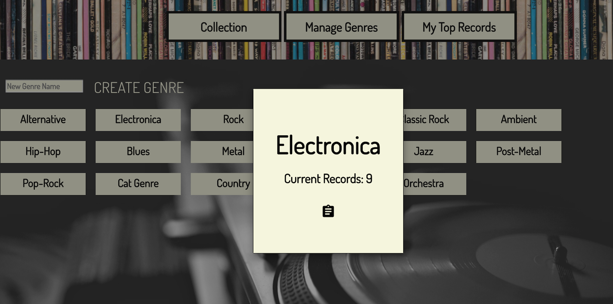

# My Record Collection - AngularJS Capstone Project

This app is a dynamic, virtual Record Collection, and was my AngularJS solo capstone project at Prime Digital Academy.
On the landing page, a user is greeted with a birds-eye view of his or her current collection.



Upon clicking an individual record, a modal will display featuring details for that record. Here, the user can also edit the record details, add it to their "Favorites", or delete it from their collection.



Users can also add records via another popup modal, which displays an input form. Any added records are immediately viewable from the landing page upon hitting "Submit"



Users can search their collection by artist name, record name, genre, or any record detail parameters. This example displays all records in the collection with the genre "Rock"



Finally, users can manage the genres in their collection and see how many records fall into each genre.



## This application is built with: 
- AngularJS
- Node.js
- Express
- Angular Material
- PostgreSQL
- pg 

## Installation
In Node.js: 
- npm start

In browser:
- navigate to "http://localhost:3086/#!/records"

### Database Setup - PostgreSQL

``` 
CREATE DATABASE record_collection

-- Create table to store genres

CREATE TABLE genres (
genre_id serial primary key,
name varchar (80),
quantity INT
);

-- Create table to store records

CREATE TABLE records (
id serial primary key,
title varchar (120),
artist varchar (80),
genre_id INT REFERENCES genres,
release_year INT,
run_time INT,
album_img varchar (200),
is_favorite BOOLEAN default FALSE,
);

### Handcrafted by Steve Hogan, 2018
